&emsp; &emsp; &emsp; [**Team and collaborators**](#team-and-collaborators) &emsp; &emsp; &emsp; [**Papers**](#principal-papers) &emsp; &emsp; &emsp; [**Projects**](#projects) &emsp; &emsp; &emsp; [**Meetings**](#meetings)

## Welcome to CRISP: Correcting Reddening Intelligently for Supernova Probes

CRISP is a multi-faceted project to study extinction towards supernovae (SNe) and their environments through a variety of observational techniques including photometry, integral field spectroscopy and polarimetry of both SNe and their hosts, as well as machine learning tools and radiative transfer modeling.

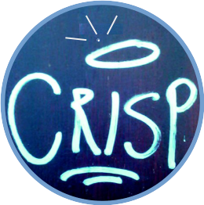

## Team and collaborators

Alejandro Yepes  
Alessandro Razza  
Ana Mourão (CENTRA-IST) 
Ana Paulina-Afonso (IA-Porto) 
Antonia Morales-Garaffolo (U.Cádiz) 
Alberto Krone-Martins (U.Cal-Irvine) 
Beatriz Pereira (CENTRA-IST) 
Caterina Corte-Real (CENTRA-IST) 
Claudia Gutiérrez (ICE-CSIC, Barcelona) 
[Francisco Förster](https://fforster.github.io/) (U.Chile) 
Gonçalo Martins (CENTRA-IST) 
João Duarte (CENTRA-IST) 
João Rino-Silvestre (CENTRA-IST) 
João Gonçalves (CENTRA-IST) 
Joe Anderson (ESO) 
[Lluis Galbany](https://lgalbany.github.io/) (ICE-CSIC) 
Marko Stalevski (O.Belgrade) 
Majda Smole (O.Belgrade) 
Pedro Garcia  
Rita Santos (CENTRA-ESO)  
[Saby Goswami](https://sabygoswami.github.io/) (IAA-CSIC, Granada) 
Santiago González-Gaitán (IA-U.Lisboa) 
Thomas de Jaeger (CNRS/LPNHE/Sorbonne) 

## Principal papers
- [RV from multi-waveband galaxy polarimetry in supernovae vicinity](https://arxiv.org/abs/2502.09875) - **J. Rino-Silvestre et al.**
- [Assessing differences between local galaxy dust attenuation and point source extinction within the same environments
](https://ui.adsabs.harvard.edu/abs/2025arXiv250304906D/abstract) - **J. Duarte et al.**
- [A sample of dust attenuation laws for Dark Energy Survey supernova host galaxies](https://ui.adsabs.harvard.edu/abs/2023A%26A...680A..56D/abstract) - **J. Duarte et al.**
- [Narrow absorption lines from intervening material in supernovae. II. Galaxy proerties](https://ui.adsabs.harvard.edu/abs/2025arXiv250307233G/abstract) - **S. González-Gaitán, C. Gutiérrez et al.**
- [Narrow absorption lines from intervening material in supernovae. I. Measurements and temporal evolution](https://ui.adsabs.harvard.edu/abs/2024A%26A...687A.108G/abstract) - **S. González-Gaitán, C. Gutiérrez et al.**
- [Dissecting the active galactic nucleus in Circinus - III. VLT/FORS2 polarimetry confirms dusty cone illuminated by a tilted accretion disc](https://ui.adsabs.harvard.edu/abs/2023MNRAS.519.3237S/abstract) - **M. Stalevski, S. González-Gaitán et al.**
- [Systematic errors on optical-SED stellar-mass estimates for galaxies across cosmic time and their impact on cosmology](https://ui.adsabs.harvard.edu/abs/2022A%26A...662A..86P/abstract) - **A. Paulino-Afonso et al.**
- [The effects of varying colour-luminosity relations on Type Ia supernova science](https://ui.adsabs.harvard.edu/abs/2021MNRAS.508.4656G/abstract) - **S. González-Gaitán, T. de Jaeger et al.**
- [Tips and tricks in linear imaging polarimetry of extended sources with FORS2 at the VLT](https://ui.adsabs.harvard.edu/abs/2020A%26A...634A..70G/abstract) - **S. González-Gaitán, A. Mourão et al.**
- [Spatial field reconstruction with INLA: application to IFU galaxy data](https://ui.adsabs.harvard.edu/abs/2019MNRAS.482.3880G/abstract) - **S. González-Gaitán and COIN.**
- [Spatial field reconstruction with INLA. Application to simulated galaxies](https://ui.adsabs.harvard.edu/abs/2023A%26A...669A.152S/abstract) - **M. Smole et al.**
- [EmulART: Emulating Radiative Transfer -- A pilot study on autoencoder based dimensionality reduction for radiative transfer models](https://ui.adsabs.harvard.edu/abs/2022arXiv221015400R/abstract) - **J. Rino-Silvestre et al.**

## Projects

### Dust from supernova environments

- **Dust biases in galaxy environments (PI: J. Duarte)**: 
Complex star-dust geometries and observing orientations have a significant effect on the obtention of attenuation optical depth and attenuation curves. By simulating dusty galaxies at different orientations with Monte Carlo radiative transfer modeling with [SKIRT](https://skirt.ugent.be/root/_landing.html), we examine the effect on the fitted dust parameters. [Paper](https://ui.adsabs.harvard.edu/abs/2025arXiv250304906D/abstract) submitted.

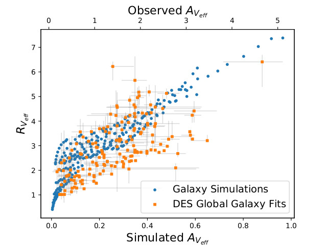

- **Dust attenuation slopes of high-z galaxies (PI: J. Duarte)**: 
We obtain a set of dust attenuation slopes for a cosmological sample of SNe Ia from their host galaxies with broad-band photometry from the Dark Energy Survey ([DES](https://www.darkenergysurvey.org/)) complemented with available GALEX UV photometry and 2MASS NIR when available. We use the SED fitter [prospector](https://prospect.readthedocs.io/en/latest/) and [FSPS](https://dfm.io/python-fsps/current/) population synthesis code. The method is tested with simulations. We find a two-dimensional dust step that is similar in magnitude and significance to the mass-step but not equal. [Paper](https://ui.adsabs.harvard.edu/abs/2023A%26A...680A..56D/abstract) published.

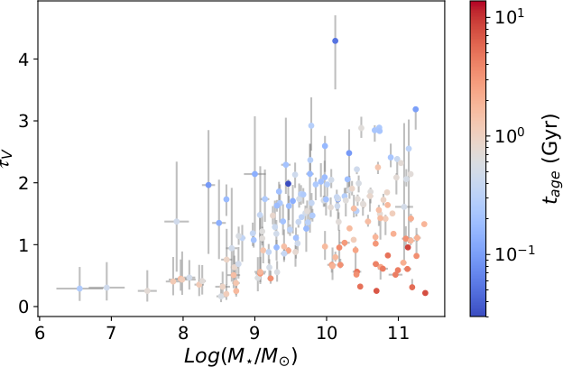
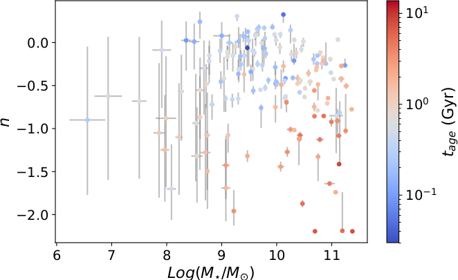

- **Dust attenuation slope maps of AMUSING galaxies**: 
We will obtain maps of dust attenuation slopes across nearby galaxies observed with Integral Fiel Spectroscopy (IFS) from the [AMUSING](https://amusing-muse.github.io/) survey. Spectra are complemented with optical, UV and NIR broad-band photometry. The method uses the SED fitter [prospector](https://prospect.readthedocs.io/en/latest/) and [FSPS](https://dfm.io/python-fsps/current/) population synthesis and is being tested with large simulations.

- **Pilot project of polarimetric studies towards galaxies: the case of Circinus (PI: M. Stalevski, S. González-Gaitán)**: 
Imaging polarimetry of the nearby Circinus galaxy, host of an Active Galactic Nucleus (AGN), taken with FORS2-VLT in multiple optical bands allows the study of the geometry and dust characteristics of the central object ([Paper I](https://ui.adsabs.harvard.edu/abs/2023MNRAS.519.3237S/abstract)) and its galaxy. 

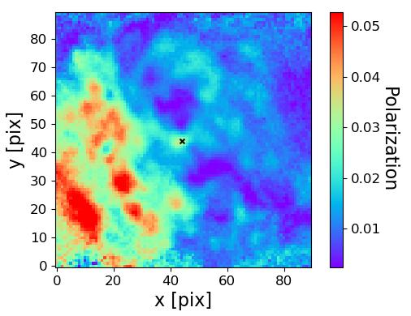

- **Polarimetric studies towards galaxies (PI: J. Rino-Silvestre)**: 
The statistical study of multi-band imaging polarimetry with optical data from FORS2-VLT provides nearby galaxy maps of various physical characteristics of the dust. The data is compared with Monte Carlo radiative transfer simulations with the code [SKIRT](https://skirt.ugent.be/root/_landing.html). A comparison of Rv values obtained at the SN position from Serkowski fits to BVRI polarimetry with estimates directly from the SN light-curves yield significant differences (see submitted [Paper](https://arxiv.org/abs/2502.09875)).

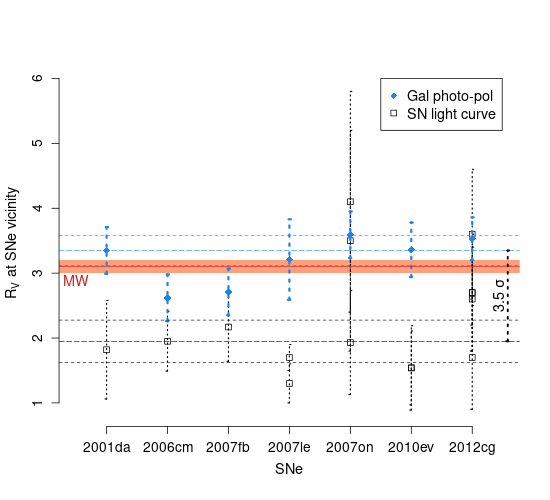

- **Interstellar lines in IFU spectra (PI: S. Goswami)**: 
We are obtaining the strength and velocity of interstellar lines like Na I D in Integral Fiel Spectroscopy (IFS) of SN host galaxies from the [AMUSING](https://amusing-muse.github.io/) survey. By fitting stellar population synthesis we subtract the stellar component and investigate the interstellar medium (ISM) tracers in the light of supernovae measurement.  

### Dust from supernovae

- **Narrow absorption lines in supernovae (PI: C. Gutiérrez, S. González-Gaitán)**: 
The narrow absorption lines found in SN spectra of all types reveal the slow moving material in the line of sight towards SNe. We are investigating the frequency, strength, evolution and velocity of several species like Na I D, Ca II H & K, K I and diffuse interstellar bands for an unprecedented large sample of supernova spectra. In [Paper I](https://ui.adsabs.harvard.edu/abs/2024A%26A...687A.108G/abstract) we develop a new robust methodology to measure narrow lines which demonstrates that there is a substantial bias from the P-Cygni profile of the supernova in low-resolution spectra. We show that statistically there is little evolution in the strength of the sodium lines for various supernova types.  

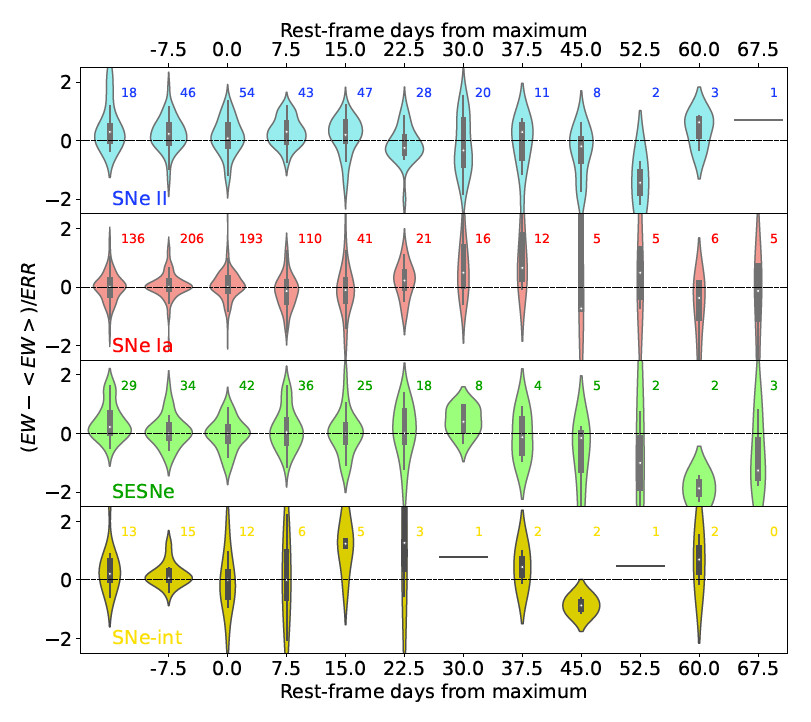

<ul>
In [Paper II](https://ui.adsabs.harvard.edu/abs/2025arXiv250307233G/abstract) we compare the strengh of the absorption lines from supernova spectra with local and global galaxy properties. We find that the lines are statistically good tracers of the interstellar medium: their strength declines exponentially with galactocentric distance and follows a power-law with local star formation rate and stellar mass.</ul>

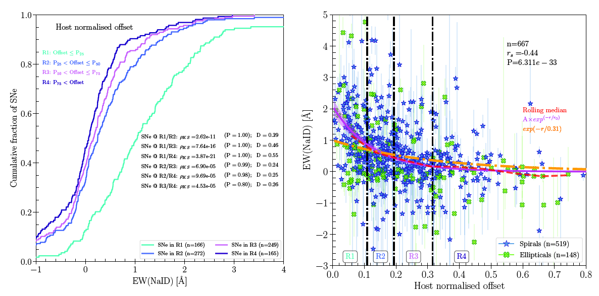

- **Intrinsic colors of type Ia supernovae (PI: C. Corte-Real)**: 
In order to properly correct for dust reddening in the line of sight of supernvoae, we need to know their intrinsic colors. These might change with intrinsic properties like lightcurve width or ejecta velocity. In this study we use several machine learning tools to look for different populations of type Ia supernovae according to color evolution and infer their intrinsic colors. 

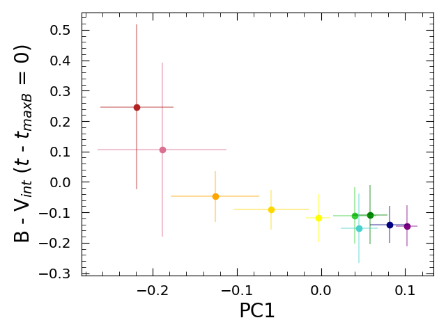

- **Dust extinction laws of DES supernovae (PI: J. Gonçalves)**: 
We are obtaining a set of dust extinction laws for a cosmological sample of SNe Ia light-curves from the Dark Energy Survey ([DES](https://www.darkenergysurvey.org/)). We use [SNpy](https://csp.obs.carnegiescience.edu/data/snpy) to constrain reddening laws. The method is tested with simulations.

- **Supernova polarization evolution (PI: A. Morales-Garoffolo)**: 
We are studying the evolution of the polarization of nearby SNe with linear imaging polarimetry with CAFOS-CAHA. Polarimetric studies reveal the asymmetries of SN explosions and provide a unique view of the interstellar and circumstellar material around them.

- **Evolution of dust reddening law towards SNe Ia (PI: A. Yepes)**: 
We investigate if the dust reddening law, Rv, changes with phase of the evolution of type Ia supernovae. We use optical and near-infrared light-curves fitted with [SNpy](https://csp.obs.carnegiescience.edu/data/snpy) to constrain reddening laws across time. This will shed light on progenitors by constraining possible circumstellar material and dust properties towards SNe Ia.

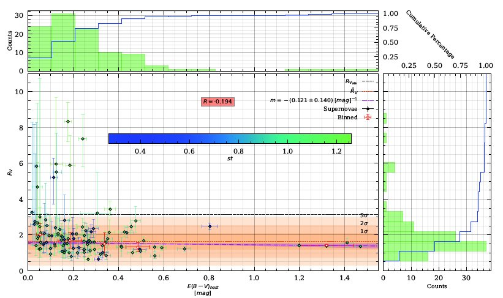

### Impact of dust on cosmology

- **ARGAS: Artifically Redshifting of Galaxies (PI: A. Paulina-Afonso)**:  
Studies have shown that type Ia supernova distance estimation improves when using an additional term related to the host galaxy mass. However, the bias and systematics of using a limited set of broad-band filters across a large redhift range has never been evaluated. With extensive simulations of nearby integral field spectroscopy (IFS) galaxies set at high redshifts, we study here the impact of effects like dimming, scaling and SED fitting in the mass-step used in cosmology for current and future SN surveys. [Paper](https://ui.adsabs.harvard.edu/abs/2022A%26A...662A..86P/abstract) published.
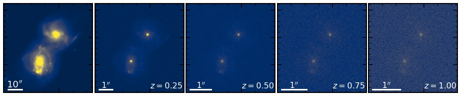

- **Impact of varying colour-luminosity relation in type Ia supernova cosmology (PI: T. de Jaeger, S. González-Gaitán)**: 
Type Ia SN cosmology has been essential in determining the accelerated expansion of the universe. However, the standardization of their luminosity to measure distances relies on a color-luminosity calibration that generally assumes a constant factor throughout the SN Ia population. We investigate in this project the effect of letting this parameter vary. [Paper](https://ui.adsabs.harvard.edu/abs/2020arXiv200913230G/abstract) published.

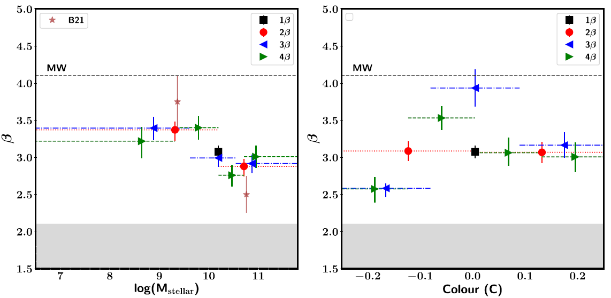

### Methods

- **Galaxy spatial field reconstruction with INLA (PI: S. González-Gaitán)**:: 
The spatial correlations of astrophysical quantities are normally poorly taken into account. As part of the [COIN](https://cosmostatistics-initiative.org/) collaboration, we use here the Integrated Nested Laplace Approximation ([INLA](https://www.r-inla.org/)) machinery to obtain meaningful spatial reconstructions of IFS galaxy properties. The algorithm is very powerful when there is sparsity of data. [Paper](https://ui.adsabs.harvard.edu/abs/2019MNRAS.482.3880G/abstract) published and [implementation](https://github.com/COINtoolbox/Galaxies_INLA).   

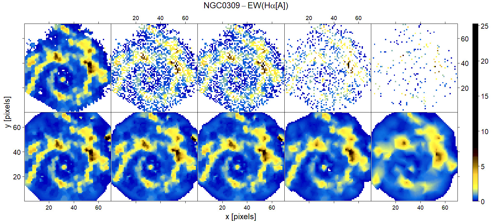

- **1.5D SED spatial fitting (PI: P. Garcia)**:
The next step of the INLA spatial fitting applied to galaxy IFS is to simulatenously fit the wavelength and the spatial dimension. In a first 1.5D approach, we iteratively fit the SED at each spaxel with [prospector](https://prospect.readthedocs.io/en/latest/) while the spatial part is done with [INLA](https://www.r-inla.org/). 

- **Optimization of radiative transfer codes (PI: M. Smole, J. Silvestre)**:
Monte Carlo radiative transfer (MCRT) codes like [SKIRT](https://skirt.ugent.be/root/_landing.html) simulate the observed distribution of light as a function of wavelength given an initial geometry and dust composition; but this is computationally expensive. We are using the [INLA](https://www.r-inla.org/) methodology and dimensionality reduction (PCA, NMF, autoencoders) to boost MCRT modeling of Active Galactic Nuclei (AGN) and AURIGA galaxies requiring less initial photons and less compuational time. [Paper I](https://ui.adsabs.harvard.edu/abs/2022arXiv221102602S/abstract) focuses on galaxies with PCA/NMF and INLA, [Paper II](https://ui.adsabs.harvard.edu/abs/2022arXiv221015400R/abstract) on spherical geometries with variatonal autoencoders (see also: [EmulART](https://github.com/SN-CRISP/EmulART)). 

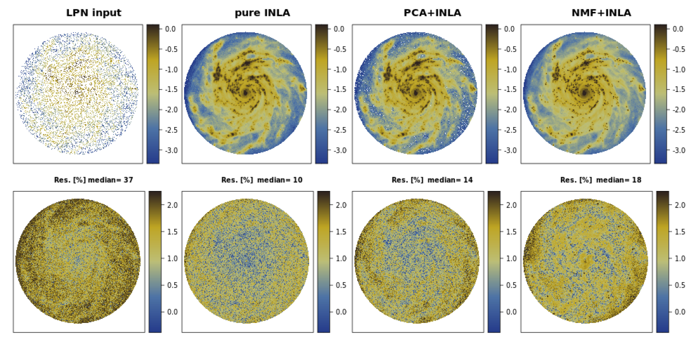

- **Instrumental field polarization of FORS2-VLT (PI: S. González-Gaitán, A Mourão)**: 
Extended imaging polarization studies requires a full characterization of the instrument which is known to produce spurious polarization patterns. We study the instrumental field polarization of the FORS2 instrument at VLT finding a radial polarization across the CCD. [Paper](https://ui.adsabs.harvard.edu/abs/2020A%26A...634A..70G/abstract) published and [implementation](https://github.com/gongsale/FORS2-INSTPOL). 

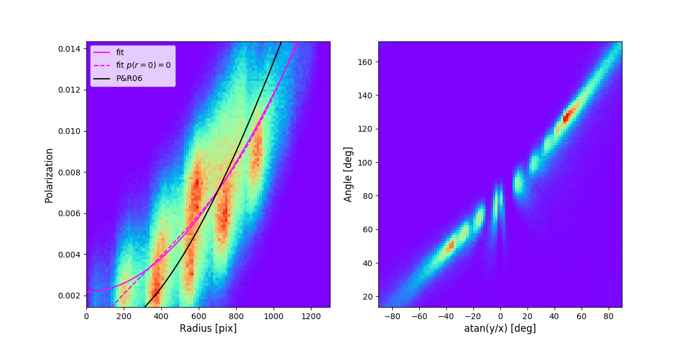

- **Moon polarization patterns in the Sky (PI: B. Pereira)**: 
The scattering from the Moon in the sky produces a polarization pattern that needs to be corrected for when performing polarimetric observations in the night. We investigate the observed pattern taken with FORS2-VLT data compared with single Rayleigh and Mie scattering and multiple scattering models.

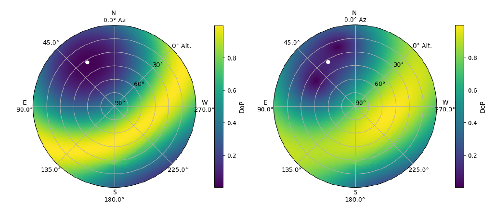

## Meetings
Some previous meetings:
- [CRISPinho 2020](https://amusing-muse.github.io/crispinho2020/)
- [CRISP 2020](https://amusing-muse.github.io/crisp2020/)
- [CRISP 2021](https://sn-crisp.github.io/CRISP2021/)
- CRISPinho 2024

## Acknowledgement
CRISP was funded during 2018-2022 by FCT (PTDC/FIS-AST-31546/2017, PI: Mourao).
